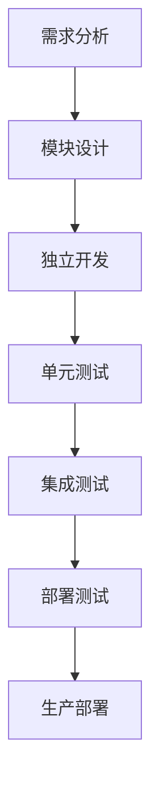

# 微前端架构规划

## 概述

Tollow项目计划在未来3-6个月内逐步迁移到微前端架构，以提升系统的可扩展性、团队协作效率和部署灵活性。

## 架构目标

### 1. 技术目标
- **模块化**: 将应用拆分为独立的微前端模块
- **技术多样性**: 支持不同技术栈的微前端
- **独立部署**: 每个微前端可以独立开发和部署
- **运行时集成**: 在运行时动态加载和集成微前端

### 2. 业务目标
- **团队协作**: 不同团队可以独立开发不同模块
- **快速迭代**: 减少模块间的耦合，提升开发速度
- **技术演进**: 支持渐进式技术栈升级
- **扩展性**: 便于添加新功能和模块

## 微前端拆分策略

### 第一阶段：核心模块拆分

#### 1. 打字练习模块 (Typing Module)
- **技术栈**: React + TypeScript
- **职责**: 打字练习核心功能
- **独立部署**: ✅
- **团队**: 核心功能团队

#### 2. 文件管理模块 (File Management Module)
- **技术栈**: React + TypeScript
- **职责**: 文件上传、处理、预览
- **独立部署**: ✅
- **团队**: 文件处理团队

#### 3. 用户管理模块 (User Management Module)
- **技术栈**: React + TypeScript
- **职责**: 用户认证、个人资料、设置
- **独立部署**: ✅
- **团队**: 用户系统团队

### 第二阶段：扩展模块拆分

#### 4. 学习分析模块 (Learning Analytics Module)
- **技术栈**: React + TypeScript + D3.js
- **职责**: 学习进度分析、数据可视化
- **独立部署**: ✅
- **团队**: 数据分析团队

#### 5. 社交功能模块 (Social Features Module)
- **技术栈**: React + TypeScript + WebRTC
- **职责**: 协作练习、排行榜、分享
- **独立部署**: ✅
- **团队**: 社交功能团队

#### 6. 内容管理模块 (Content Management Module)
- **技术栈**: React + TypeScript + CMS
- **职责**: 文本内容管理、分类、推荐
- **独立部署**: ✅
- **团队**: 内容运营团队

## 技术架构设计

### 1. 微前端框架选择

#### 推荐方案：Module Federation (Webpack 5)
```typescript
// 主应用配置
const ModuleFederationPlugin = require('webpack/lib/container/ModuleFederationPlugin');

module.exports = {
  plugins: [
    new ModuleFederationPlugin({
      name: 'tollow-shell',
      remotes: {
        typingModule: 'typingModule@http://localhost:3001/remoteEntry.js',
        fileModule: 'fileModule@http://localhost:3002/remoteEntry.js',
        userModule: 'userModule@http://localhost:3003/remoteEntry.js',
      },
      shared: {
        react: { singleton: true },
        'react-dom': { singleton: true },
        'react-router-dom': { singleton: true },
      },
    }),
  ],
};
```

#### 备选方案：Single-SPA
```typescript
// 微前端注册
import { registerApplication, start } from 'single-spa';

registerApplication({
  name: 'typing-module',
  app: () => import('./typing-module'),
  activeWhen: '/practice',
});

registerApplication({
  name: 'file-module',
  app: () => import('./file-module'),
  activeWhen: '/upload',
});

start();
```

### 2. 通信机制

#### 事件总线
```typescript
// 全局事件总线
class EventBus {
  private events: Map<string, Function[]> = new Map();

  on(event: string, callback: Function) {
    if (!this.events.has(event)) {
      this.events.set(event, []);
    }
    this.events.get(event)!.push(callback);
  }

  emit(event: string, data?: any) {
    if (this.events.has(event)) {
      this.events.get(event)!.forEach(callback => callback(data));
    }
  }

  off(event: string, callback: Function) {
    if (this.events.has(event)) {
      const callbacks = this.events.get(event)!;
      const index = callbacks.indexOf(callback);
      if (index > -1) {
        callbacks.splice(index, 1);
      }
    }
  }
}

export const globalEventBus = new EventBus();
```

#### 状态共享
```typescript
// 共享状态管理
interface SharedState {
  user: User | null;
  theme: Theme;
  language: string;
}

class SharedStateManager {
  private state: SharedState;
  private subscribers: Set<(state: SharedState) => void> = new Set();

  constructor(initialState: SharedState) {
    this.state = initialState;
  }

  getState(): SharedState {
    return { ...this.state };
  }

  setState(newState: Partial<SharedState>) {
    this.state = { ...this.state, ...newState };
    this.notifySubscribers();
  }

  subscribe(callback: (state: SharedState) => void) {
    this.subscribers.add(callback);
    return () => this.subscribers.delete(callback);
  }

  private notifySubscribers() {
    this.subscribers.forEach(callback => callback(this.state));
  }
}
```

### 3. 路由管理

#### 统一路由配置
```typescript
// 路由配置
interface RouteConfig {
  path: string;
  module: string;
  component: string;
  permissions?: string[];
}

const routes: RouteConfig[] = [
  {
    path: '/practice',
    module: 'typing-module',
    component: 'TypingPractice',
    permissions: ['user'],
  },
  {
    path: '/upload',
    module: 'file-module',
    component: 'FileUpload',
    permissions: ['user'],
  },
  {
    path: '/profile',
    module: 'user-module',
    component: 'UserProfile',
    permissions: ['user'],
  },
];
```

## 部署策略

### 1. 容器化部署
```dockerfile
# 微前端容器示例
FROM node:18-alpine

WORKDIR /app
COPY package*.json ./
RUN npm ci --only=production

COPY . .
RUN npm run build

EXPOSE 3000
CMD ["npm", "start"]
```

### 2. 服务网格
```yaml
# Kubernetes配置示例
apiVersion: apps/v1
kind: Deployment
metadata:
  name: typing-module
spec:
  replicas: 3
  selector:
    matchLabels:
      app: typing-module
  template:
    metadata:
      labels:
        app: typing-module
    spec:
      containers:
      - name: typing-module
        image: tollow/typing-module:latest
        ports:
        - containerPort: 3001
```

### 3. CDN分发
```typescript
// CDN配置
const CDN_CONFIG = {
  baseUrl: 'https://cdn.tollow.com',
  modules: {
    'typing-module': '/modules/typing/latest',
    'file-module': '/modules/file/latest',
    'user-module': '/modules/user/latest',
  },
  versioning: 'semver',
  fallback: 'local',
};
```

## 开发流程

### 1. 模块开发流程


### 2. 版本管理策略
- **语义化版本**: 遵循SemVer规范
- **向后兼容**: 确保API向后兼容
- **渐进式升级**: 支持渐进式功能升级
- **回滚机制**: 快速回滚到稳定版本

### 3. 测试策略
- **单元测试**: 每个模块独立的单元测试
- **集成测试**: 模块间的集成测试
- **端到端测试**: 完整的用户流程测试
- **性能测试**: 模块加载和运行性能测试

## 监控和运维

### 1. 性能监控
```typescript
// 性能监控
class MicroFrontendMonitor {
  private metrics: Map<string, PerformanceMetric[]> = new Map();

  trackModuleLoad(moduleName: string, loadTime: number) {
    if (!this.metrics.has(moduleName)) {
      this.metrics.set(moduleName, []);
    }
    
    this.metrics.get(moduleName)!.push({
      timestamp: Date.now(),
      loadTime,
      type: 'module_load',
    });
  }

  trackModuleError(moduleName: string, error: Error) {
    // 错误追踪逻辑
  }

  getMetrics(moduleName: string): PerformanceMetric[] {
    return this.metrics.get(moduleName) || [];
  }
}
```

### 2. 健康检查
```typescript
// 健康检查
class HealthChecker {
  async checkModuleHealth(moduleUrl: string): Promise<boolean> {
    try {
      const response = await fetch(`${moduleUrl}/health`);
      return response.ok;
    } catch (error) {
      return false;
    }
  }

  async checkAllModules(): Promise<HealthStatus> {
    const modules = ['typing', 'file', 'user'];
    const results = await Promise.all(
      modules.map(async (module) => ({
        name: module,
        healthy: await this.checkModuleHealth(`/modules/${module}`),
      }))
    );

    return {
      timestamp: Date.now(),
      modules: results,
      overall: results.every(r => r.healthy),
    };
  }
}
```

## 风险评估和缓解

### 1. 技术风险
- **复杂性增加**: 微前端架构增加了系统复杂性
- **性能影响**: 模块加载可能影响性能
- **兼容性问题**: 不同模块间的兼容性问题

### 2. 缓解措施
- **渐进式迁移**: 逐步迁移，降低风险
- **性能优化**: 实现智能预加载和缓存
- **标准化**: 建立统一的开发规范和接口标准

## 时间规划

### 第一阶段 (1-2个月)
- [ ] 微前端架构设计
- [ ] 核心模块拆分
- [ ] 基础框架搭建

### 第二阶段 (3-4个月)
- [ ] 模块独立开发
- [ ] 集成测试
- [ ] 性能优化

### 第三阶段 (5-6个月)
- [ ] 生产环境部署
- [ ] 监控系统完善
- [ ] 团队培训

## 总结

微前端架构将为Tollow项目带来以下优势：

1. **技术灵活性**: 支持不同技术栈和框架
2. **团队协作**: 提升开发效率和团队协作
3. **部署灵活性**: 支持独立部署和快速迭代
4. **扩展性**: 便于添加新功能和模块
5. **维护性**: 降低模块间耦合，提升维护性

通过合理的架构设计和实施策略，微前端架构将帮助Tollow项目实现更好的技术架构和业务价值。
